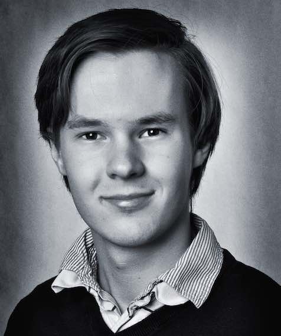

title: About - Martin Kaptein
description: Here yo will find the CV of Martin Kaptein. He speaks a lot of languages including Dutch, German, English and Russian. Additonally, he speaks the language of music and some computer languages.

# About Martin Kaptein

My name is Martin Kaptein and I am from the Netherlands. 

I speak a lot of languages including Dutch, German, English and Russian. Additonally, I speak the language of music and some computer languages.

## Education and Study

In 2015, finished the general qualification for university entrance (=Abitur) in Germany (Gymnasium). Thus, I have an advanced school-leaving certificate with very good marks.

Currently, I am studying classical music for the subject of classical piano at the ArtEz conservatory in Zwolle, the Netherlands.
My main subject teacher is Michail Markov.

## My experience in Music

Martin Kaptein has a lot of experience in playing solo concerts but also playing in ensembles. Furthermore, Martin Kaptein participates frequently in competitions, masterclasses and festivals in different countries.

- 2013 International Music Festival of the Isle of Rhodes, Greece
- 2014 Martin was finalist (prix promotion) in Flame Piano Competition in Paris, France
- 2014 International Music Academy in Cremona, Italy
- 2015 Martin won the first price in the St. Cecilia International Pianocompetition in Porto, Portugal
- 2015 and 2016 International Piano Festival in Duzsniky, Poland
- 2016 first price Vught klassiek competition in the Netherlands

## IT experience

I am a very big fan of all modern technologies and follow the developements of them closely.

Right now, my favourite programming languages are Javascript and Python. I prefer Javascript, because it's very easy to run on any platform or device, and Python, because of its ease of use a big amount of amazing libraries.

Take a look at [my Github profile](https://github.com/martinkaptein/) to see some of the things I made.

Furthermore, I have some experience with PHP and MySQL as I have run a social network a few years ago. This means that along front-end experience (HTML5) I have also some experience with back-end server configuration (apache).

To round off I know the usual suspects such as yml, git, bash, markdown and a bit of json and ajax.