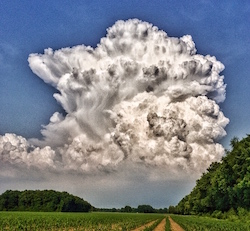
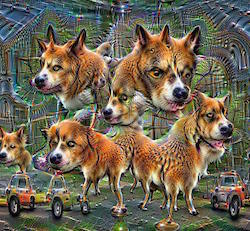
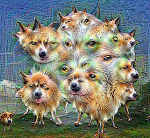
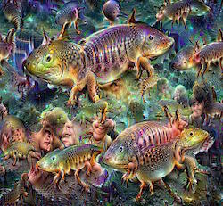
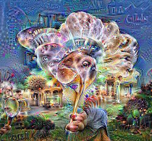

title: Exploring Google DeepDream and getting nice images
description: Exploring Google DeepDream and getting very cool results. My experiences and modifications to the source code.

*June 2, 2017*

By **Martin Kaptein**
***
# Playing around with Google's DeepDream and how to get best results

In this Blog post I would like to explore Google DeepDream and report about my experiences with it.

## Introduction to Google DeepDream

Google DeepDream is an [open source program, created by Google](https://github.com/google/deepdream), which uses a convolutional neural networks (CNN's) to find and enhance patterns in images. 

This can lead to very cool-looking results.

What I like about Google DeepDream is that it provides a very visual approach and representation of an, otherwise, very abstract topic.

In this Blog post I will share some of my results and settings which I used.

## The source image

I used an image (which I took myself) of clouds:



*My source image, input for DeepDream*

In my experience the image dimension should be somewhere between 700 pixels sq and 200 pixels sq (not necessarily square, of course). Large images take an extremely long time to process, but can also provide really beautiful results.

Also, the size of the *Dream stuff* doesn't scale with the image (probably depends on the trained model).

Intrestingly enough, images with clouds tend to be most interesting. Humans do also tend to interpret different things when looking at clouds, so that's a nice parallel.

## My results

Here are some of my favourite results I got:



*Default settings*

This is done, basically with the default settings of Google (but used **98 iterations**)

    make_step(net, step_size=1.5, end='inception_4c/output', jitter=32, clip=True, objective=objective_L2)
    
    deepdream(net, base_img, iter_n=11, octave_n=4, octave_scale=1.4, 
              end='inception_4c/output', clip=True, **step_params)
              



*Layer: end='inception_4b/output'*

Whilst you can see in the first image more or less complete dogs, here it's more ears and eyes. This makes sense, as it's a 'lower level layer'.



*Layer: end='inception_5a/output'*

This yields a very abstract result. Probably my favourite. This particular picture **used 123 iterations** (more on that later).



*Layer: end='inception_5b/output'*

Well, I leave this one to you.

*Note: I had to down-scale these images, so that this site loads a bit faster :P I hope that's ok*

## Modifications to the source code

The only modification I made was to 're-dream' every image (quite a large number of times).

This helps to get a more vivid result.

Here is the script I made (it saves every iteration, so you can make a nice .gif or something later). Also, it doesn't crash due to memory issues.

```

for i in xrange(somenumber):
    frame = deepdream(net, frame)
    PIL.Image.fromarray(np.uint8(frame)).save("output/%04d.jpg"%frame_i)
    frame = np.float32(PIL.Image.open('output/%04d.jpg'%frame_i))
    frame_i += 1
    
```

## Conclusion

I personally like this topic very much. Will probably write other blog posts about this too (for example, about using different models).