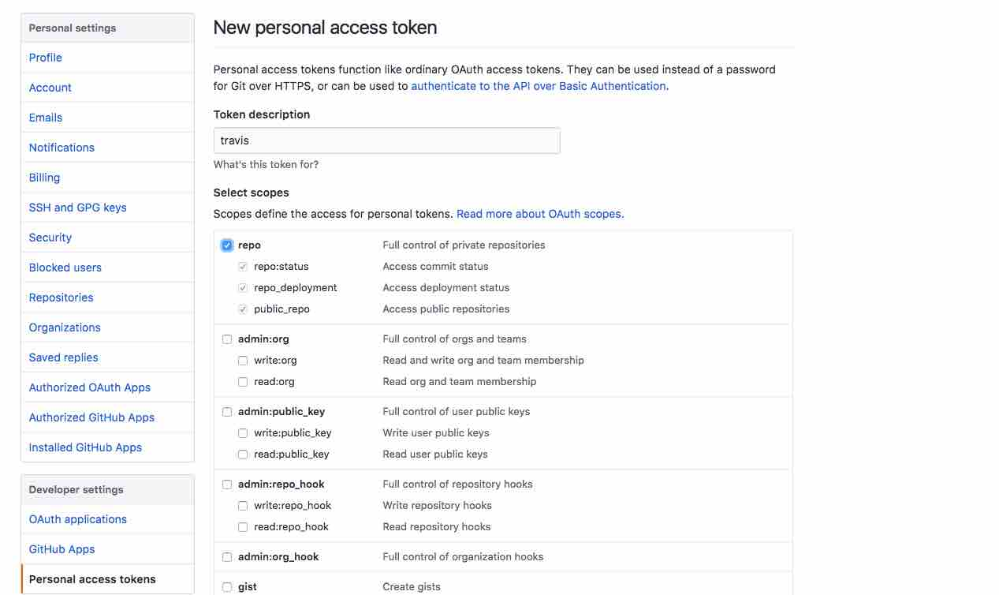
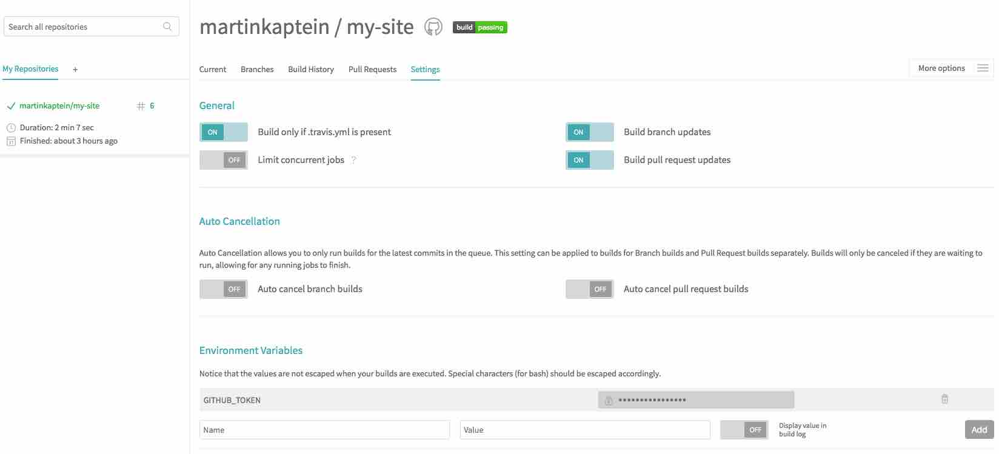

title: Using Hugo with Travis CI on GitHub Pages
description: In this blog post I will show how to build your static website with Hugo and deploy it to GitHub pages automatically using Travis CI. This can have a lot of benefits: For example, you can fix typo's directly from the Github web interface from your phone (without editing raw HTML). I kept the whole setup as minimal as possible. Hence, no bash script or travis command line tools are required.

*May 26, 2017*

By **Martin Kaptein**

***

# Using Hugo with Travis CI on GitHub Pages

## Introduction

In this blog post I will show how to build your static website with [Hugo](https://gohugo.io) and deploy it to [GitHub pages](https://pages.github.com/) automatically using [Travis CI](https://travis-ci.org). 

This can have a lot of benefits: For example, you can fix typo's directly from the Github web interface from your phone (without editing raw HTML).

As a matter of fact [this website](#) is build this way: The source, located at [github.com/martinkaptein/my-site](https://github.com/martinkaptein/my-site) will be build and pushed into [github.com/martinkaptein/martinkaptein.github.io](https://github.com/martinkaptein/martinkaptein.github.io) with Travis CI. 

Due to various reasons I decided to use different repositories rather than one repo with different branches.

Also, I kept the whole setup as minimal as possible. Hence, no bash script or travis command line tools are required.

## Travis CI setup

### travis.yml

First of all, you will need to add a `.travis.yml` file to the root of your source directory. Please be aware that your operating system may hide the file.

Paste this into your `.travis.yml` file **and edit it as necessary** (instrucions provided).


```

language: go

go:
  - master # This uses automatically the latest version of go

install:
  - go get github.com/spf13/hugo # This provides the latest version of Hugo to Travis CI

script:
  - hugo # This commands builds your website on travis

deploy:
  local_dir: public # Default static site output dir for Hugo
  repo: <yourusername>/<yourusername>.github.io # This is the slug of the repo you want to deploy your site to
  target_branch: master # GitHub pages branch to deploy to (in other cases it can be gh-pages)
  provider: pages
  skip_cleanup: true
  github_token: $GITHUB_TOKEN # This is the authentication which you will setup in the next step in travis-ci dashboard
  email: yourmail@mail.com
  name: "Your username"
  on:
    branch: master
```


### GitHub authentication

Let's setup the git authentication.

Generate a Personal Access Token from this GitHub page: [github.com/settings/tokens](https://github.com/settings/tokens).

Please make sure to check repo - full control of repositories (the rest you don't need to enable).



*Generating a GitHub access token for Travis CI*

Copy the secret key to your clipboard and head over to [https://travis-ci.org/](https://travis-ci.org/).

Enable your source repository and turn the following options to on:

- Build only if .travis.yml is present
- Build branch updates
- Build pull request updates

Then, scroll down and add a environment variable:

Set `Name` to `GITHUB_TOKEN` and paste your secret key (from the clipboard) to the `Value` field.

When you added it, it should hide the value and keep it secure (it is encrypted), according to the travis-ci docs.

The settings should look like this:



*My Travis CI dashboard settings.*

### Push to your source repo

Now, it's time to see Travis CI in action: Just git add `.travis.yml`, commit and push.

The build process should start automatically and push to your GitHub Pages repo.

## Summary

To sum up, this is a very minimal travis-ci setup. It's worth noting that Travis CI will always check for and download the latest version of `go` and `hugo`. 

To speed the process up, you could move the hugo binaries to your source repo. But for the sake of simlicity I have omitted these options.
