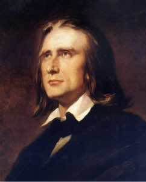
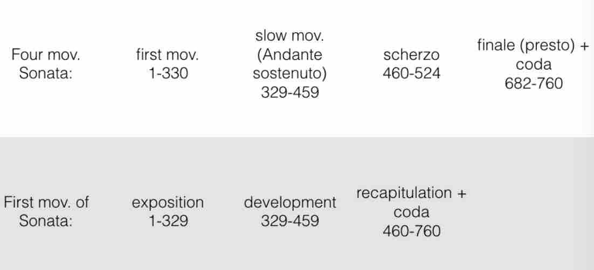
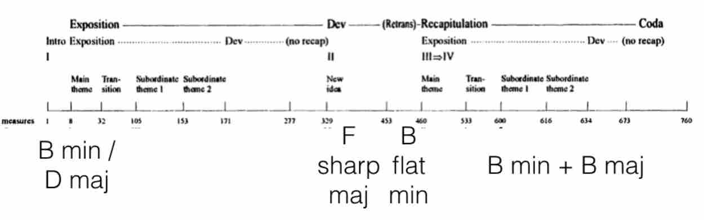

title: F. Liszt b minor sonata analysis
description: This is Martin Kaptein's analysis of the famous b minor Sonata by Franz Liszt.

*March 30, 2017*

By **Martin Kaptein**

***

# F. Liszt b minor Sonata Analysis

*Maestro Franz Liszt*

## Introduction

*Before I begin with the analysis I would like to make clear that my view towards this Sonata is very biased as, having played this piece myself, I am a huge fan of this Sonata (it is one of my favourite pieces ever composed for piano). Furthermore, there is a chance that not all information is correct (depends somewhat on your definition of 'correct'), so you have been warned.*

Along with Beethoven’s Hammerklavier and Schubert’s Wanderer Fantasie, the B minor Sonata of Franz Liszt is, with its duration of about 30 minutes one of the, technically and musically most difficult and elaborate Piano Sonata composition of the 19th century.

### Historic context
The sonata was published in the spring of 1854 (performed ’57) and dedicated to Robert Schumann. Liszt meant this as a reciprocal gesture to Schumann in response to his being the dedicatee of the latter’s Fantasy in C major (1839), a work that Liszt described as sublime.

However, Schumann never knew of the B Minor Sonata’s existence since by the time a copy of the newly published work arrived at the Schumann’s home in May, 1854, Schumann was already at the asylum at Endenich.

### Possible meanings of the Sonata
There are some theories about the meaning of the Sonata, although, intrestingly enough, Liszt never said anything about any programmatic context.

Here are some popular theories:

- The Sonata is a musical portrait of the Faust legend (by Göthe) with themes and motifs of Faust, Gretchen and Mephistopheles

- The Sonata has autobiographical content

An example for the latter is Liszt’s relationship with the Princess Carolyne von Sayn-Wittgenstein, his mistress for thirteen years at Weimar and close friend for the better part of half of a century (with themes and motifs of Liszt and Carolyne).

- The juxtaposition of good and evil, about the divine and the diabolical

- Allegory set in the garden of Eden (biblical context)

- The sonata has no meaning at all

Personally, I think the fact that Liszt never mentioned any programmatic context, makes this sonata even more special. This way, it appears almost mysterically veiled; giving insight in something that is, ultimately, not depictable by words, only by music.

## Form

### Introduction
Now, I would like to present the Form of this piece which is very complicated.

The sonata unfolds in approximately 30 minutes of unbroken music. While its four distinct movements are rolled into one, the entire work is encompassed within the traditional Classical sonata scheme — exposition, development, and recapitulation. 

Liszt has effectively composed a sonata within a sonata, which is part of the work's uniqueness. Liszt was very economical with his thematic material, indeed, the very first page contains the three motivic ideas that provide the content, transformed throughout, for nearly all that follows.

### Liszt's inspiration
It is likely that Liszt derived the idea of thematic transformation as a unifying process from Schubert’s Wanderer Fantasy, a work which he himself transcribed for piano and orchestra in 1851 (which is a one-movement sonata, and a traditional four-movement sonata the same time). 

This is all possible because every single movement is built around the same motif, which is itself derived from the opening phrase of Schubert’s lied Der Wanderer. It’s very clear that it was a source of inspiration for Liszt. Also, just as in the Liszt Sonata, the four movements are played without a break.

### Formal structure

*Here is a table which shows my approximation of the formal structure (although there are many other possibilities as claimed by theorists such as Newman or Winklhofer). Numbers are the Bars, for idea of proportion.*

Hence, this Sonata is one of the first instances of a Double-function form, a musical piece which has two classical forms happening at the same time. Composers like Schönberg later drew inspiration from this.

### Themes and motifs
This is an appropriate moment to present the themes of the Sonata. The main theme is scattered across the first page (of the Emil von Sauer edition of the Score), which functions as a prologue. 

The first part of the theme consists of a double drumbeat (unisono, G) and a descending scale(phrygian and gypsy) , which can be interpreted as a theme on its own.

The second part of the theme consist of a (unisono) octave leap and as a very energetic and strong willed character. Perhaps it is an image of Faust. the third part of the main theme is the hammerblow (quick repetition of notes) which has a very demonic character and could very well represent Mephisto (from Goethe’s ‘Faust’).

By the way this theme is later transformed into the 2nd Subordinate theme.  Everything in this Sonata is build around these 3 mini-themes.

The epilogue (last page in the Emil von Sauer edition) consist of the same motifs as the prologue but in a different key and in reverse order. This, kind of makes this piece symmetrical and, probably, has a symbolic meaning of returning to the same point (beginning>>ending) after a long journey.

*To help make myself clear, here is an overview of the themes and the keys.*

## Analysis of my favourite passages

Next, I would like to show some passages, which are very interesting (macro analysis).

### Recitativo
The first passage is the Recitativo (from Bar 297). This Recitativo can be seen as the transition from the 1st movement into the 2nd mov. (andante sostenuto). It is made of the 1st Subordinate theme and features very special 3rd relations: C sharp minor 64 chord, A major, A augmented and D major, all the time with G sharp as a pedal point (which really adds a lot of tension).

After the first Recitativo comes a similar passage (Bar 302): F minor >> D flat major >> D flat augmented and G flat augmented. After that it goes on with the half - whole scale which transitions trough the mephisto theme (bar 319) into the 2nd movement.

### Fugato
Now I’d like to write about the Fugato (from Bar 460), which is the transition to the Recapitulation.

The final recapitulatory section is launched by a driving fugato of contrapuntal skill which leads to the compressed return of the opening material. Calling upon every intellectual resource and fully exploiting the pianist's technical arsenal, it is at this point where a performer's concentration might flag. 

But this final section has only just begun, and a pianist needs to have reserved fuel in his tank if he is to turn in a successful performance of the sonata. Up to Bar 522 its fugue-like in 3 parts. 

The fugato is in B flat minor using motif the 2nd and 3rd motif from the prologue. At one point the fugato subject is turned upside down and presented in counterpoint against itself. 

This fugato has a very ironic and diabolic character. Perhaps it is a conversation between Faust and Mephisto? After the fugal entries the fugato modulates enharmonically and moves from a polyphonic to a more homophone texture where the recapitulation is started.

### Epiloque
Last but not least I would like to end with the epilogue. Like I indicated earlier, it consist of the same motifs as the prologue but reharmonised and in reverse order. 

A very special moment in the final chord progression (Bar 755 and following): A major >> F major >> And B major. F major and B major are located as far as possible form each other in the circle of fifth. 

This chord progression has a very special effect and is, probably, one of the most amazing chord progressions in romantic music.

## Conclusion

As you have, probably, noticed, it is impossible to make a black - white kind of analysis of this sonata, which makes it really interesting.

In my opinion, this music isn’t meant to be nice music in a narrow sense, but it tells a story. It’s up to the performer and the listener to understand it.