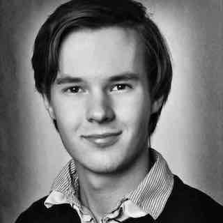

title: Home - Martin Kaptein
description: My name is Martin Kaptein and I am from the Netherlands. I am a musician and pianist. Furthermore, I am a technology enthusiast and a software programmer.

# Welcome to my Website!

## My name is Martin Kaptein and I am from the Netherlands

 

*Martin Kaptein (me)*

## What I do

I am a very passionate musician and pianist. Currently, I am studying classical music in the Netherlands and regularly give concerts on demand and play in ensembles.

I have a deep interest in different kinds of music and I don't exclude the possibility of composing music at some point in the future.

[Contact me](contact.md) for information about my current repertoire and other requests. Also, feel free to take a look at [my YouTube channel](https://www.youtube.com/channel/UCosUIzMUriRTgg60vh3EwCQ) to hear me playing.

Furthermore, I am a technology enthusiast and a software programmer. I build stuff in my free time, some of which you can find on [my Github profile](https://github.com/martinkaptein/). I also create websites and want to build an AI.

In my free time, I write articles on a variety of different topics, which you can find on this site.

***

## My Resume

### Highschool

In 2015, I finished the general qualification for university entrance (=Abitur) in Germany (Gymnasium). Thus, I have an advanced school-leaving certificate with splendid marks.

### Bachelor

Currently, for my bachelor studies, I am studying classical music for the subject of classical piano at the ArtEz conservatory in Zwolle, the Netherlands.

### Natural Languages

I speak English, Dutch, German and Russian fluently. Furthermore, I am quite familiar with French (and have a DELF certificate).

### Music experience

I have a lot of experience in playing solo concerts, with wide varieties of repertoire. Also, I enjoy playing in ensembles very much. Furthermore, I participate frequently in competitions, masterclasses and festivals in different countries, for example:

- 2013 International Music Festival of the Isle of Rhodes, Greece (1st price)
- 2014 Martin Kaptein was finalist (prix promotion) in Flame Piano Competition in Paris, France
- 2014 International Music Academy in Cremona, Italy (2nd price )
- 2015 Martin Kaptein won the first price in the St. Cecilia International Pianocompetition in Porto, Portugal
- 2015 and 2016 International Piano Festival in Duzsniky, Poland
- 2016 first price Vught klassiek competition in the Netherlands

### IT experience

I have experience with a wide variety of different technologies, especially Javascript and Python.
Also, I have extended knowledge of [Wordpress](https://wordpress.com/) and Static Site Generators (such as [jekyll](https://jekyllrb.com/) or [hugo](https://gohugo.io/)).
By the way, I have even [written my own static site generator](blog/pythoncms.md) in Python which you can find [here](blog/pythoncms.md).

Besides that, I am familiar with:

- [Creating websites](contact.md)
- PHP & MySQL
- HTML5
- GIT vcs, Travis CI, Netlify
- Bash
- UNIX stuff

Furhermore, I have a very profound interest for Artificial Inteligence, Deep Neural Networks and convolutional neural networks.

### Other interests

I read a lot of books and like to take pictures. For latter, I suggest to head to my Instagram [@martinkaptein](https://www.instagram.com/martinkaptein/).

