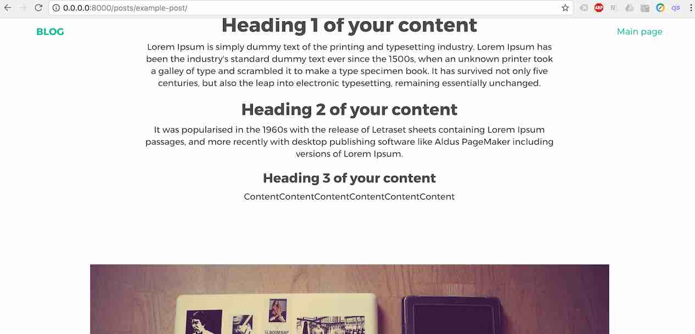

title: PythonCMS - A static blog and site generator
description: PythonCMS is a static blog and site generator, written in Python 3, which is fully portable and very easy to use.

# PythonCMS - Static Blog Generator

## Introduction

PythonCMS is a static blog and site generator, written in Python 3, which is fully portable and very easy to use.

> My idea is to create something that is refreshingly easy and simple to use,
> requiring only basic knowledge of HTML, yet being very flexible.

***

*An example post using PythonCMS*

### Advantages of PythonCMS

- No config files
- It fully portable
- No local webserver required
- Very easy theming
- Easy Search Engine Optimization (SEO)
- AMP & Analytics support

## Quickstart guide

It is very easy to get started with PythonCMS.

### Installing Python 3

Make sure you have installed Python 3.x (any version 3 will work).
If not, [download Python 3 here](https://www.python.org/downloads/).

### Cloning the repository

Clone the PythonCMS repository into the directory of your future site (or blog):

    git clone https://github.com/martinkaptein/pythonCMS.git
    cd pythonCMS
    
### Customizing the main page

Edit the `index.html` file in the root of the directory. This will become the main page of the blog (or site).

I recommend to change the links for the social networks. Feel free to adjust everything to your liking except for the ` $InsertLatestPostBelow ` tag. It is required for the script to work.

### Writing your first blog post

Your working directory is inside the ` drafts/drafts ` folder.

Write your first blog entry in ` drafts/drafts/draft.html ` or ` drafts/drafts/example.html `. Again, change it however you want.

For future posts you can create or rename any *.html files inside the ` drafts/drafts ` folder. You have full freedom!

#### Adding media to the blog post

For media (such as images) put them into the media folder (` media/ `) and link 2 levels up from your draft.html:

    
    
#### Analytics and SEO

Add any meta, script etc. tags as you would do normally. There are explanatory comments.
    
#### Previewing your post

Preview your post by opening the `draft.html` file you just edited (no local webserver neccessary for preview).

However, it is still good practise to use a simple webserver like:

    python -m SimpleHTTPServer

### Generating the site

Now it's time to build the site!

Run pythonCMS.py:

    python pythonCMS.py
    
If you have 2 python installations run:

    python3 pythonCMS.py
    
The instructions on screen will guide you through the process.

After that just upload the whole folder to your site (ftp, ssh, whatever).
Since PythonCMS is fully portable this is possible without problems.

I even included a `robots.txt` to exclude the drafts from being indexed by search engines.

Done!

## Theming

This is the easy part!
Basically you can change everything **except**:

- ` $InsertLatestPostBelow `  (in the root `index.html`) since it's required for PythonCMS to generate the menu system
- For styling and javascript, make sure `draft.html` links 2 levels up:

Like this:

    src="../../assets"
    
That is it!

## AMP

See [https://ampbyexample.com/](https://ampbyexample.com/) for theming, then apply standart theming procedure for this static site generator.

## Future release ideas

- add markdown support
- backwards compatibility with Python 2

## Notes

The default theme has been made and published by/at [http://blacktie.co/](http://blacktie.co/) so it's not by me.
Props for them for their amazing work!

Find the source at [github.com/martinkaptein/pythonCMS](https://github.com/martinkaptein/pythonCMS). Ideas for features and contributions are welcome!